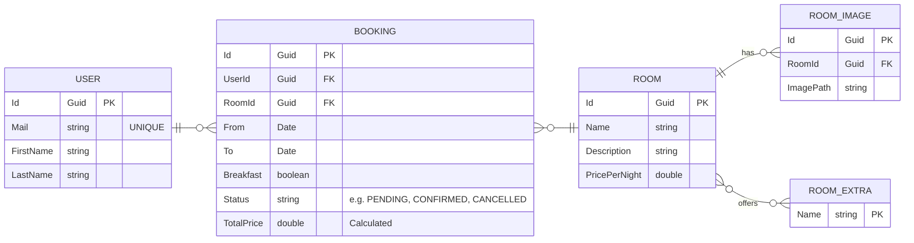

```mermaid
    erDiagram
        direction LR
        USER ||--o{ BOOKING: ""
        BOOKING }o--|| ROOM: ""
        ROOM ||--o{ ROOM_IMAGE: "has"
        ROOM }o--o{ ROOM_EXTRA: "offers"
        USER {
            Id Guid PK
            Mail string "UNIQUE"
            FirstName string
            LastName string
        }
        BOOKING {
            Id Guid PK
            UserId Guid FK
            RoomId Guid FK
            From Date
            To Date
            Breakfast boolean
            Status string "e.g. PENDING, CONFIRMED, CANCELLED"
            TotalPrice double "Calculated"
        }
        ROOM {
            Id Guid PK
            Name string
            Description string
            PricePerNight double
        }
        ROOM_IMAGE {
            Id Guid PK
            RoomId Guid FK
            ImagePath string
        }
        ROOM_EXTRA {
            Name string PK
        }
```