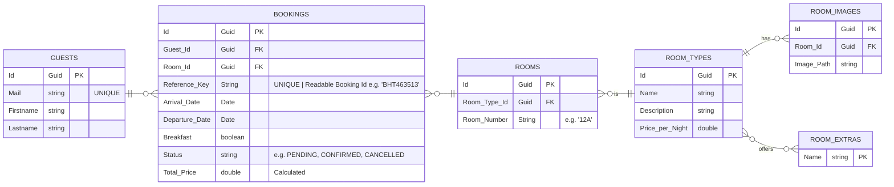

```mermaid
    erDiagram
        direction LR
        GUESTS ||--o{ BOOKINGS: ""
        BOOKINGS }o--|| ROOMS: ""
        ROOMS }o--|| ROOM_TYPES: "is"
        ROOM_TYPES ||--o{ ROOM_IMAGES: "has"
        ROOM_TYPES }o--o{ ROOM_EXTRAS: "offers"
        GUESTS {
            Id Guid PK
            Mail string "UNIQUE"
            Firstname string
            Lastname string
        }
        BOOKINGS {
            Id Guid PK 
            Guest_Id Guid FK
            Room_Id Guid FK
            Reference_Key String "UNIQUE | Readable Booking Id e.g. 'BHT463513'"
            Arrival_Date Date
            Departure_Date Date
            Breakfast boolean
            Status string "e.g. PENDING, CONFIRMED, CANCELLED"
            Total_Price double "Calculated"
        }
        ROOMS {
            Id Guid PK
            Room_Type_Id Guid FK
            Room_Number String "e.g. '12A'"
        }
        ROOM_TYPES {
            Id Guid PK
            Name string
            Description string
            Price_per_Night double
        }
        ROOM_IMAGES {
            Id Guid PK
            Room_Id Guid FK
            Image_Path string
        }
        ROOM_EXTRAS {
            Name string PK
        }
```