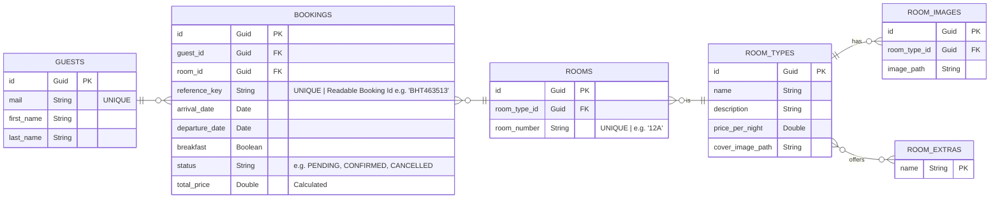

```mermaid
    erDiagram
        direction LR
        GUESTS ||--o{ BOOKINGS: ""
        BOOKINGS }o--|| ROOMS: ""
        ROOMS }o--|| ROOM_TYPES: "is"
        ROOM_TYPES ||--o{ ROOM_IMAGES: "has"
        ROOM_TYPES }o--o{ ROOM_EXTRAS: "offers"
        GUESTS {
            id Guid PK
            mail String "UNIQUE"
            first_name String
            last_name String
        }
        BOOKINGS {
            id Guid PK 
            guest_id Guid FK
            room_id Guid FK
            reference_key String "UNIQUE | Readable Booking Id e.g. 'BHT463513'"
            arrival_date Date
            departure_date Date
            breakfast Boolean
            status String "e.g. PENDING, CONFIRMED, CANCELLED"
            total_price Double "Calculated"
        }
        ROOMS {
            id Guid PK
            room_type_id Guid FK
            room_number String "UNIQUE | e.g. '12A'"
        }
        ROOM_TYPES {
            id Guid PK
            name String
            description String
            price_per_night Double
            cover_image_path String
        }
        ROOM_IMAGES {
            id Guid PK
            room_type_id Guid FK
            image_path String
        }
        ROOM_EXTRAS {
            name String PK
        }
```