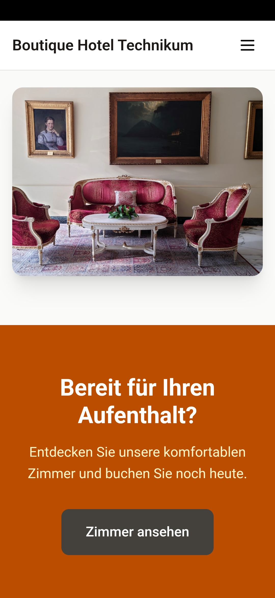
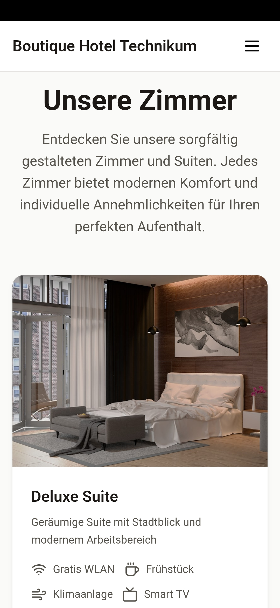
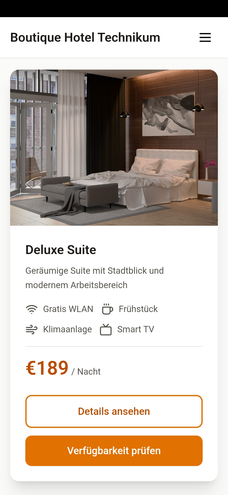
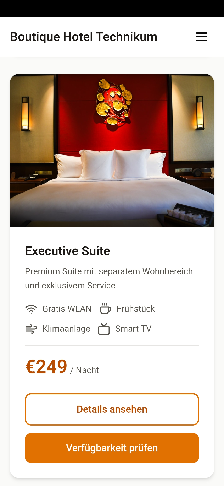
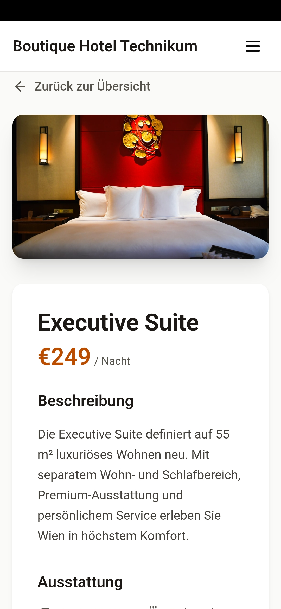
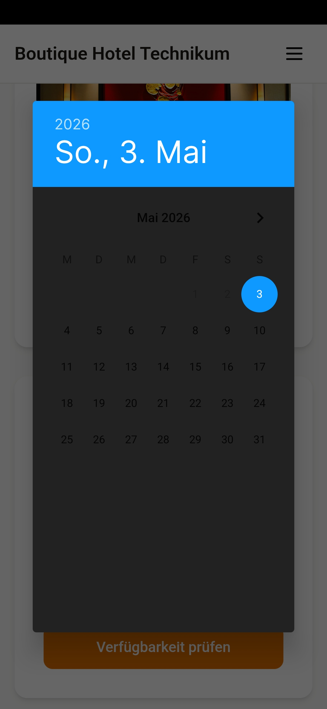
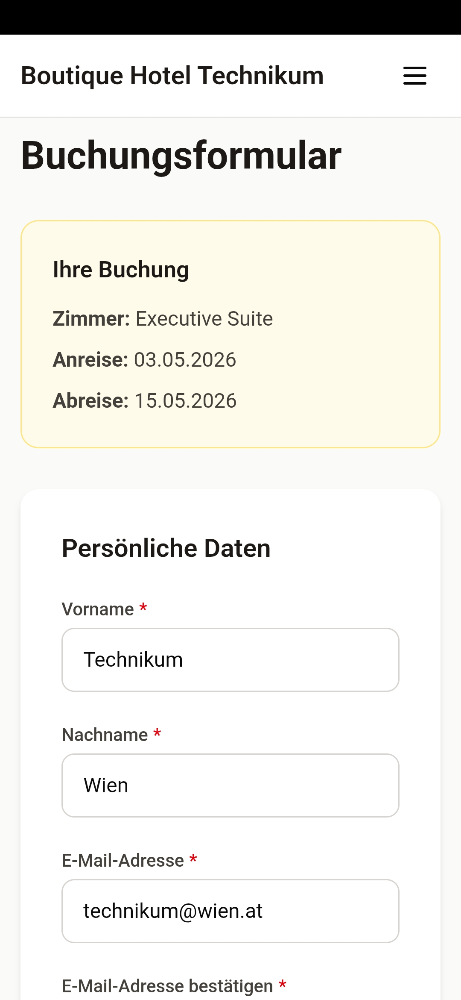
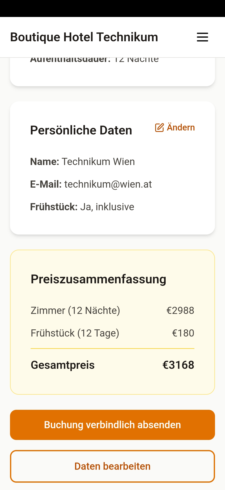
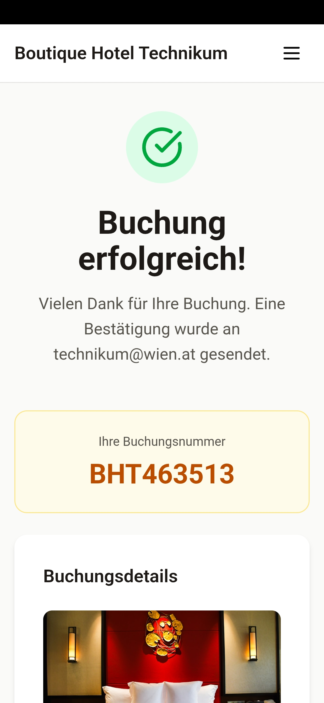
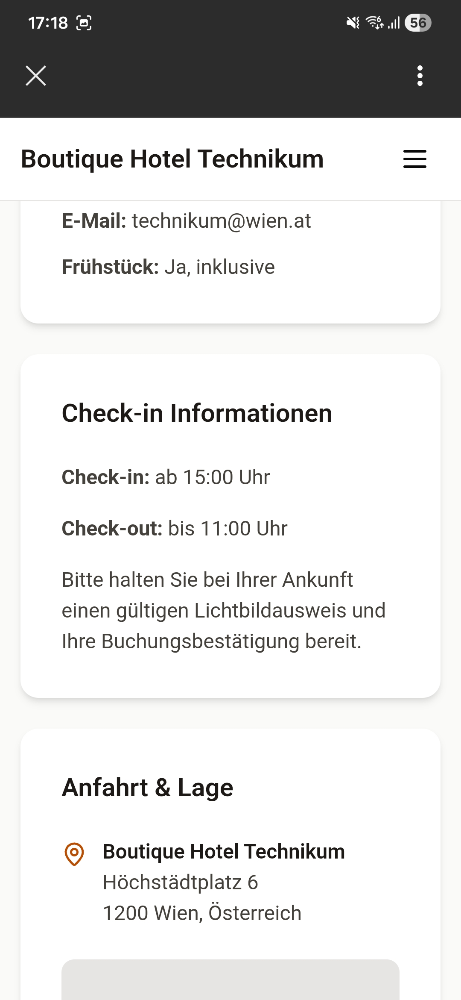

# Paper Prototype – UI Flow

Dieses Dokument zeigt den UI-Flow der App anhand von Paper-Prototype-Screenshots.  
Die Screens sind in der Reihenfolge dargestellt, in der sie durch Navigation (Button-Klicks) erreicht werden.

---

## Screen 1 - Home-Page

---

## Screen 2 - Zimmer-Ansicht

---

## Screen 3 - Zimmer-Details

---

## Screen 4 - Verfügbarkeitsprüfung

---

## Screen 5 - Buchungsformular

---

## Screen 6 - Buchung überprüfen

---
## Screen 7 - Buchungsbestätigung/details

